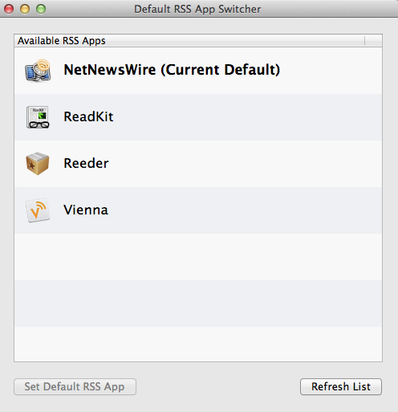

# Default RSS App Switcher

Mac OS X utility for changing the default app that handles RSS feeds from Safari.

## Download
[Download App](https://dl.dropboxusercontent.com/u/1990969/DefaultRSSAppSwitcher.zip "Download App")

## Instructions
- Select an app from the **Available RSS Apps** list to handle RSS feeds from Safari.
- Press the **Set Default RSS App** button (Or double-click the item. Or press **return** on the keyboard).
- The new default RSS app will be highlighted in bold.
- Press the **Refresh List** button if you install or delete an RSS app while this app is running.

## Requirements
Mac OS X 10.8

## License
Default RSS App Switcher is available under the [MIT License](https://github.com/BryanLuby/DefaultRSSAppSwitcher/blob/master/LICENSE "License").